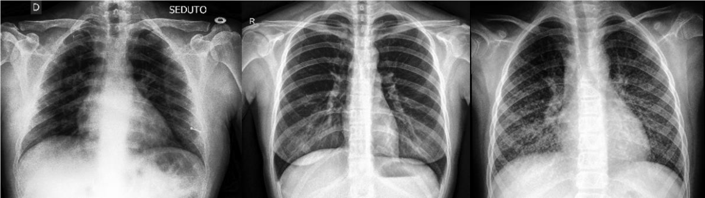
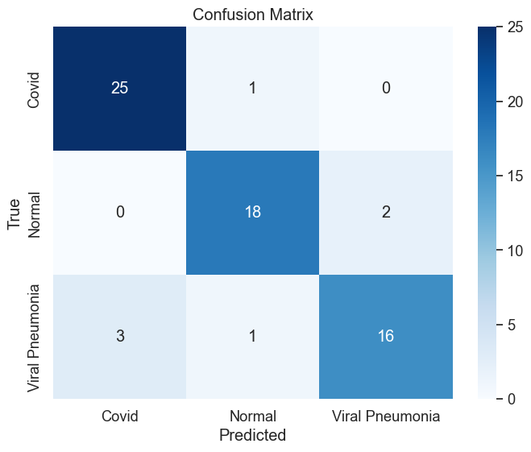
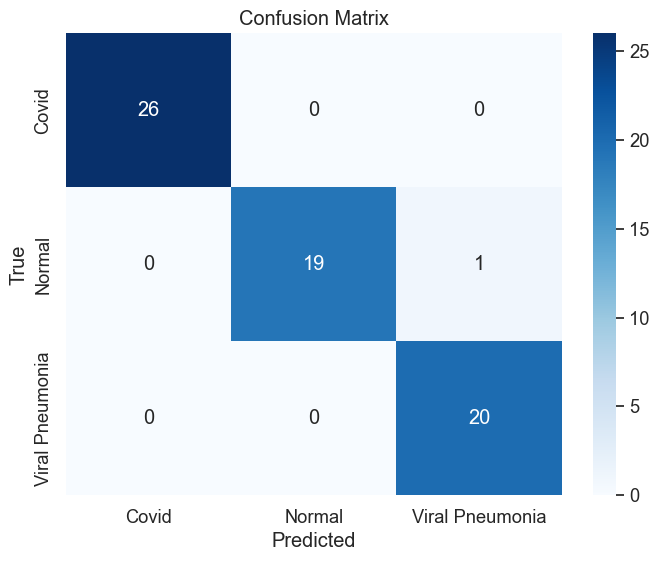
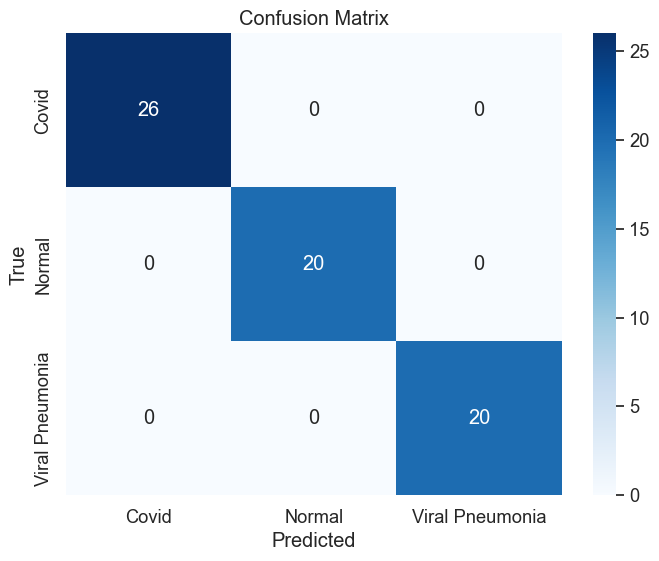
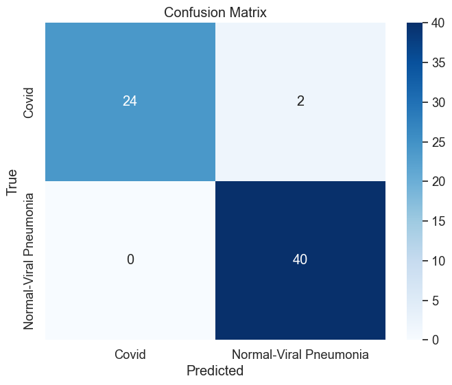
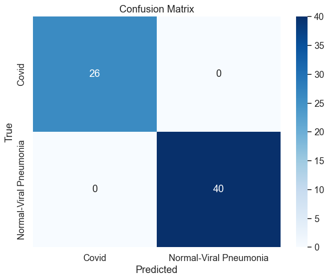
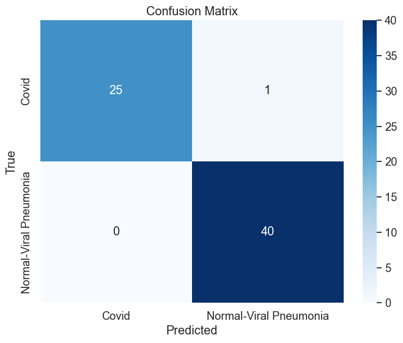

# COVID-19 prediction using neural networks models based on lung x-rays
The project aimed to create a classification model capable of accurately distinguishing three main categories based on X-ray images: cases of COVID-19 infection, healthy cases (normal), and cases of virus-induced pneumonia (Viral Pneumonia). Additionally, in a subsequent stage, it was modified for binary classification to determine whether COVID-19 was present in the images or not. These models demonstrated higher overall accuracy; however, concerning binary classification, it was not possible to verify whether a patient with a negative COVID result was healthy or infected with another disease.

## Dataset

The project utilized a publicly available dataset - the Covid-19 Image Dataset, containing diverse X-ray images categorized into three classes. The dataset owner provided a pre-defined split between training and testing sets, eliminating the need for manual data splitting. This stable division ensures objectivity in model comparisons and facilitates the comparability of experimental results.

The images in the dataset exhibit various file types, primarily in jpg and png formats, as well as different resolutions. To standardize the data, the images were scaled to a size of 432x432 px in the dataloader. Additionally, some images required conversion from RGB to grayscale. The final step in image preparation involved normalization, setting mean=0.5 and std=0.5. Normalized images were then transformed into tensors by the requirements of the PyTorch library.

*Examples of source photos (COVID19, Normal, Viral Pneumonia)*

### Link to dataset:
https://www.kaggle.com/datasets/pranavraikokte/covid19-image-dataset

# Results

## 3 class classification

| Model                         | Epochs| Accuracy | Precision | Recall | F1 Score |
|-------------------------------|-------|----------|-----------|--------|----------|
| CNN1                          | 5     | 89.35%   | 89.4%     | 89.4%  | 89.3%    |
| CNN2                          | 10    | 93.94%   | 94.2%     | 93.9%  | 93.9%    |
| U-Net                         | 100   | 98.49%   | 98.55%    | 98.48% | 98.48%   |
| ResNet (Pretrained)           | 100   | 100.0%   | 100.0%    | 100.0% | 100.0%   |

*CNN1 confusion matrix*

*CNN2 confusion matrix*

*U-Net confusion matrix*

*ResNet confusion matrix*

## Binary classification 

| Model                         | Epochs| Accuracy | Precision | Recall | F1 Score |
|-------------------------------|-------|----------|-----------|--------|----------|
| CNN1                          | 20    | 96.97%   | 97.11%    | 96.97% | 96.95%   |
| CNN2                          | 20    | 100.0%   | 100.0%    | 100.0% | 100.0%   |
| U-Net                         | 30    | 100.0%   | 100.0%    | 100.0% | 100.0%   |
| ResNet (Pretrained)           | 15    | 100.0%   | 100.0%    | 100.0% | 100.0%   |
| ResNet (Randomly initialized) | 20    | 96.97%   | 97.11%    | 96.97% | 96.95%   |

*CNN1 confusion matrix*

*CNN2 confusion matrix*

*U-Net confusion matrix*

*ResNet Pretrained confusion matrix*

*ResNet Randomly initialized confusion matrix*

